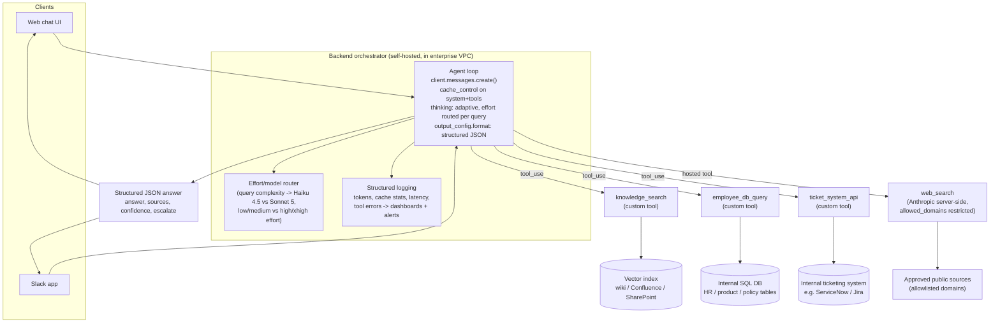

# Claude Solution Architecture Review — Enterprise Knowledge Assistant

A production-ready solution architecture for an enterprise AI knowledge assistant built on
the Anthropic Claude platform. Built for the "Claude Solution Architecture Review" lab
(Module 2, The Anthropic Claude Platform).

This repo is a **design review**, not a running application — it addresses every point
required by the brief: solution overview, Messages API usage, tool integration strategy,
extended thinking policy, prompt caching strategy, performance monitoring, and cost
optimization, plus a rationale for each major decision and a cost/performance summary.

## Contents

- [`docs/design-review.md`](docs/design-review.md) — the 1–2 page design review document
- [`docs/rationale.md`](docs/rationale.md) — rationale for each major architectural decision
- [`docs/cost-performance-summary.md`](docs/cost-performance-summary.md) — cost model and monitored metrics
- Architecture diagram — below, and duplicated at the top of the design review

## Architecture

See [`docs/design-review.md`](docs/design-review.md) for the full narrative behind this
diagram, and [`docs/rationale.md`](docs/rationale.md) for why each box is there instead of
an alternative.

## Evaluation criteria mapping

| Criterion | Where it's addressed |
|---|---|
| Technical accuracy | Model pricing, thinking/effort behavior, caching mechanics, and Priority Tier eligibility in this design reflect the current Claude API (not deprecated patterns like fixed `budget_tokens`) — see `docs/cost-performance-summary.md` footnotes and `docs/rationale.md` |
| Understanding of Claude capabilities | `docs/design-review.md` §2–5 (Messages API usage, tools, extended thinking, caching) |
| Quality of architectural decisions | `docs/rationale.md` — alternative(s) considered for every major decision |
| Cost and performance considerations | `docs/cost-performance-summary.md` — pricing, per-query cost model, aggregate projection, monitoring targets |
| Clarity of communication | Design review kept to ~1–2 pages; supporting detail kept in separate, clearly-scoped files rather than one long document |
